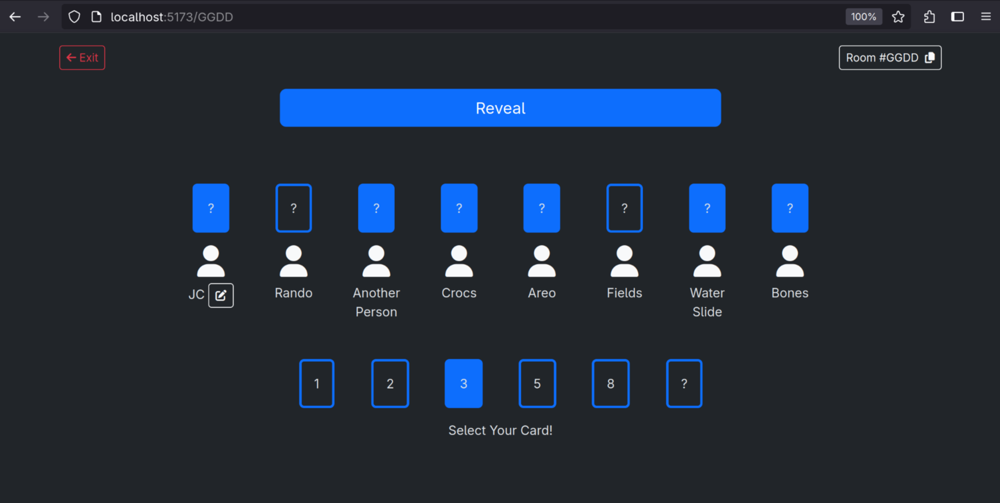
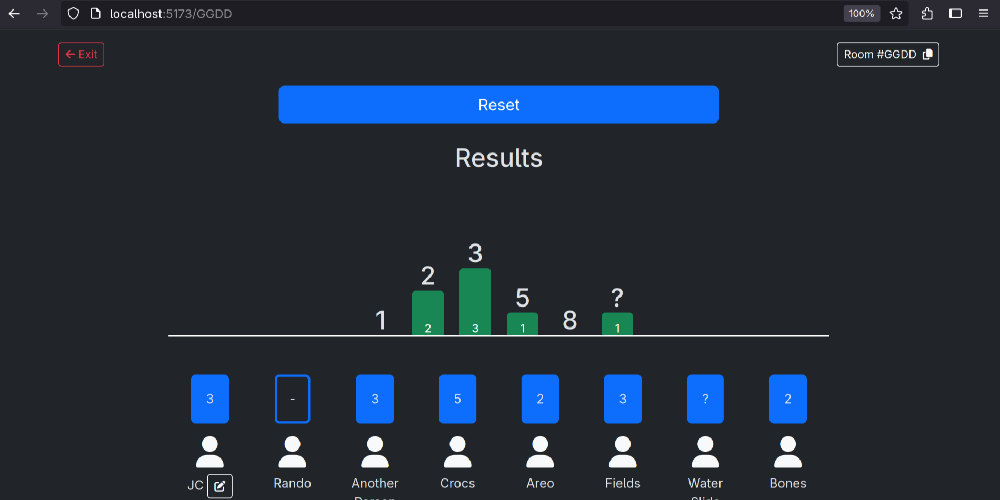

# Points

A point picker that isn't trying to sell you premium version or ask for your email.

Created using Socket.io, Vite, & Bootstrap.

This works with a Node.js backend which can be found here: [Points Server](https://github.com/JCSergent/points-server)

### Landing Page

### Selecting Points

### Showing Results

